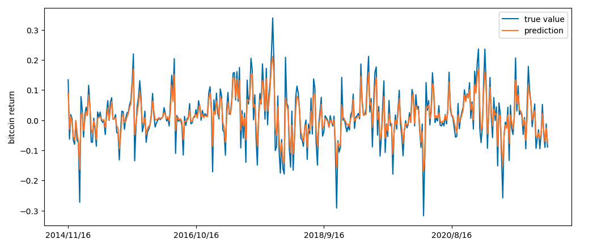
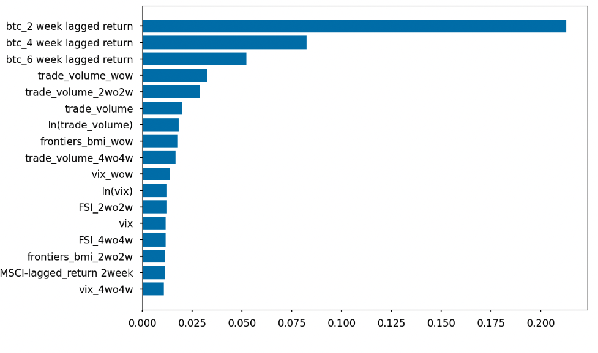
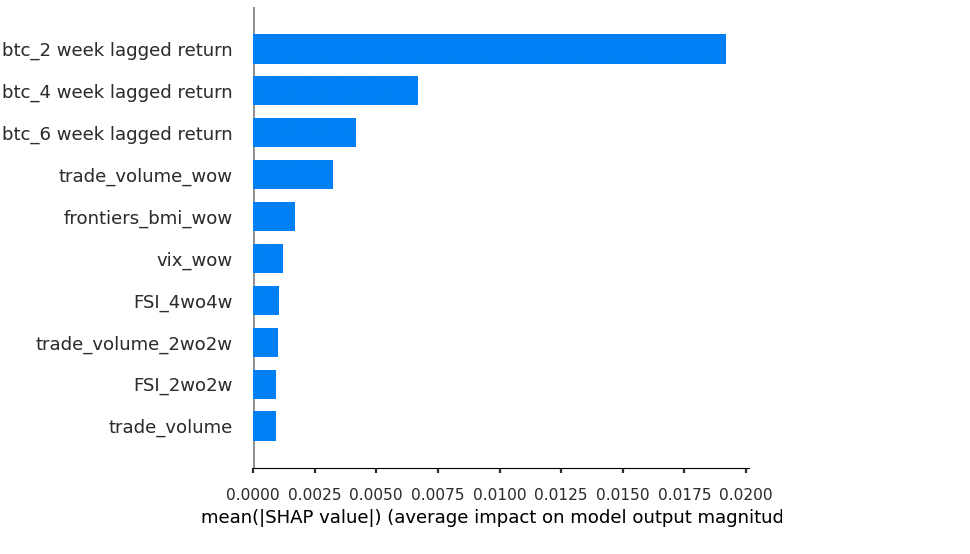
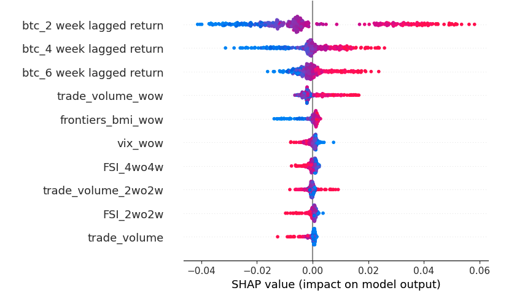
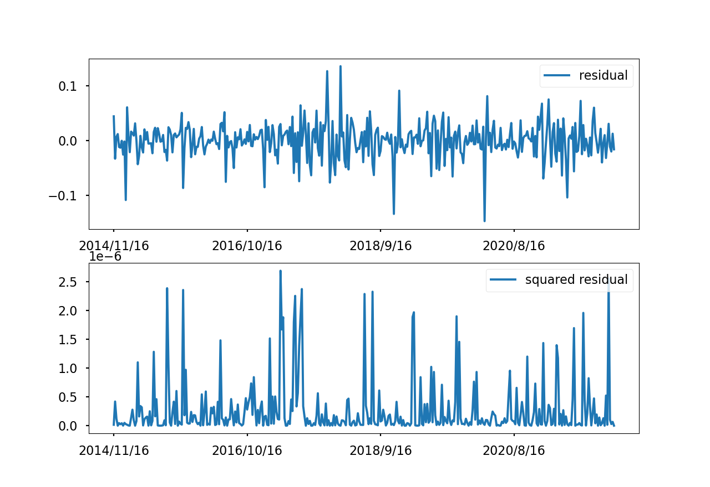
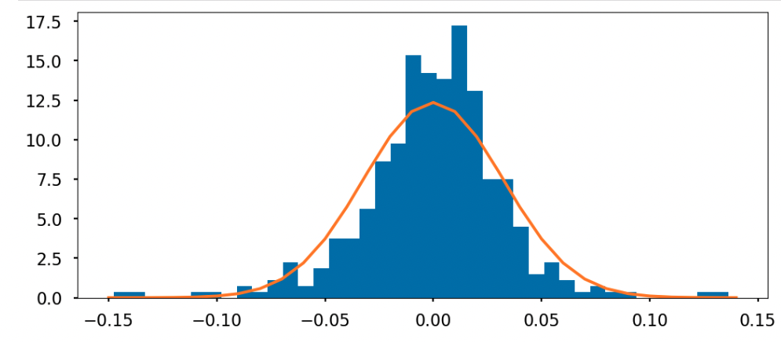
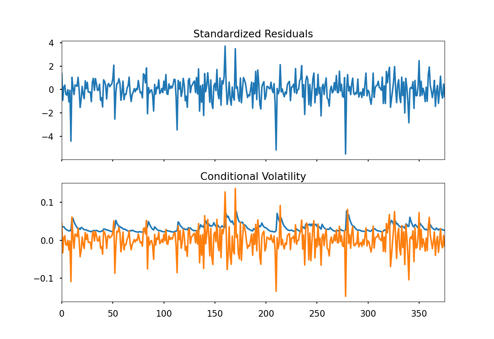

 <h1>隨機森林預測比特幣平均報酬及GARCH波動程度分析</h1> 

# 組員
- 經濟四 b08303101 郭沛孚
- 經濟四 b08303033 葉秀軒
# 動機
一直以來對於加密貨幣一直有高風險、缺乏價格解釋基礎的特質，且有許多研究主題是探討比特幣的是否具有交易性質，也就是影響其價格的因素或者是報酬率，是否並非是單純的投機動機。而許多研究表明目前比特幣仍舊偏投資目的，可以做為分散風險的資產，我們的研究主題是利用隨機森林建構預測比特幣的週報酬率模型，且考慮六種類別的解釋變數，包含匯率、經濟政策不確定指數、交易量與價格、勞動供給情形、市場環境，且因為資料是時間序列也考慮落後效果。最後評估模型預測得出的殘差是否具有自我相關的性質，以GARCH模型捕捉風險波動程度。

# 研究方法
### 隨機森林
以交叉驗證及格點搜尋計算法選出下列適合模型的超參數，但因為資料具有時序性質，如果以傳統的交叉驗證進行，則會有數據洩漏(data leakage)的問題，簡而言之就是未來的訊息會參與到當前模型的預測，進而產生作弊的效果。我們採用的時間序列交叉驗證具體方法是假設有n筆資料且切一份，給定驗證集的大小為k筆資料，且跳過m筆資料，則訓練集即是所有時點在驗證集前的 n-k-m筆資料，切成更多的份數以此類推。舉例來說如果切成兩份，第一份中{$y_{t-k+1}$, ...$y_t$}為驗證集，{$y_1$, ...$y_{t-k-m}$}為訓練集，第二份為：{$y_{t-2k+1}$, ...$y_{t-k}$}為驗證集，{$y_1$, ...$y_{t-2k-m}$}為訓練集，更多的份數以此類推。
- 決策樹在分裂節點時所考慮的最大特徵數(max_features)
- 決策樹的數量(n_estimators)
- 每個葉節點最小樣本數(min_sample_leaf)
- 每個決策樹的最大深度(max_depth)

### GARCH模型(Generalized AutoRegressive Conditional Heteroskedasticity)
在確定殘差項為定態時間序列後，觀察其自相關函數及偏自相關函數落後一期的相關性需有一定的影響，且將殘差向的平方對其落後一期的殘差項平方回歸，係數是顯著的，判定其具有自我相關及條件異質變異的特性，方才使用GARCH模型加以捕捉。
1. ARCH 效果檢定（$\epsilon\_t$為t期預測的殘差項)
$$ \epsilon_t^2 = \beta_0 + \beta_1\epsilon_{t-1}^2 $$

2. 殘差項分配假設
- 常態、Students' t、廣義誤差
- 通常以Students' t 分配捕捉財務時間序列中厚尾的性質（極值出現之機率密度較高）

3. GARCH(1, 1)
$$ \epsilon_t = v_t\sqrt{h_t}$$
其中 $v_t \sim^{i.i.d} (0, 1)$且
$$ h_t = \beta_0 + \beta_1\epsilon_{t-1}^2 + \beta_2h_{t-1}$$

# 變數
1.	匯率：
- 名目已開發經濟體指數、名目已開發經濟體指數取對數
- 名目新興經濟體指數、名目新興經濟體指數取對數
- 歐元、巴西雷亞爾、中國人民幣、印度盧比、墨西哥披索、南非鍰、日圓、韓圓、港幣、英鎊
2.	政策不確定指數:
- 經濟政策不確定指數(economics policy uncertainty index, EPU)
    - 墨西哥、智利、美國、全球、中國、俄羅斯、印度、巴西
- 貨幣政策不確定指數(monetary policy uncertainty index, MPU): 全球、美國
- 財政政策不確定指數(fiscal policy uncertainty indes, FPU): 美國
3.	交易量與價格
- 價格、對數價格
- 與法定貨幣的交易量(trading volume)、與法定貨幣的交易量
- 比特幣內的交易量(transaction volume)、比特幣內的交易量取對數
- 買賣價差(bid-ask spread)
4.	勞動供給情形
- 美國初請失業救濟金人數(initial jobless claims)
- 美國初請失業救濟金人數取對數
- 美國連續失業救濟金人數(continuous jobless claims)
- 美國連續失業救濟金人數取對數
5.	市場環境
- 摩根指數(Morgan Stanley capital international index, MSCI)、摩根指數取對數
- VIX指數、VIX指數取對數
- TED 利差
- 美國十年期公債與三個月公債利差
- 金融壓力指數(financial stress index, FSI)
- 標普前沿市場指數(S&P frontiers broad markets index, S&P frontiers BMI)
- 標普前沿市場指數取對數
6.	落後效果
- 一週：
    - 摩根指數、比特幣週報酬、與法定貨幣交易量、比特幣內的交易量、美國連續失業救濟金人數、美國初請失業救濟金人數、名目已開發經濟體指數、名目新興經濟體指數、VIX指數、TED 利差、美國十年期公債與三個月公債利差、金融壓力指數、買賣價差、標普前沿市場指數
- 二週：
    - 摩根指數、比特幣週報酬、與法定貨幣交易量、比特幣內的交易量、美國連續失業救濟金人數、美國初請失業救濟金人數、名目已開發經濟體指數、名目新興經濟體指數、VIX指數、TED 利差、美國十年期公債與三個月公債利差、金融壓力指數、買賣價差、標普前沿市場指數
-	四週：
    - 摩根指數、比特幣週報酬、與法定貨幣交易量、比特幣內的交易量、美國連續失業救濟金人數、美國初請失業救濟金人數、名目已開發經濟體指數、名目新興經濟體指數、VIX指數、TED 利差、美國十年期公債與三個月公債利差、金融壓力指數、買賣價差、標普前沿市場指數
-	六週： 比特幣週報酬
-	八週： 摩根指數

# 研究結果：
### 隨機森林
1. 預測誤差(RMSE):0.0323

2. 重要性分析
- 隨機森林(以不純度為參考)

- SHAP(SHapley additive explanantion)

3. 結論
  
可以看出落後期的比特幣報酬率、與法定貨幣的交易量、VIX指數、金融壓力指數、標普前沿市場指數對於當期的比特幣報酬率有較大的影響力，其中自我相關的影響都是正的，及過去的報酬越高，當期的報酬也越高，而市場情況如果越不穩定，如VIX、FSI指數越高則報酬率越低。可以得出比特幣的報酬率除了自我相關外，亦受到市場環境影響較大，可能反應市場上充斥著投機的熱潮。 

  

### GARCH
1. ARCH 效果檢定: 由係數顯著可以看出報酬率存在自我相關
<table class="simpletable">
<tr>
   <td></td>     <th>coef</th>     <th>std err</th>      <th>t</th>      <th>P>|t|</th>  <th>[0.025</th>    <th>0.975]</th>  
</tr>
<tr>
  <th>x1</th> <td>    0.3693</td> <td>    0.048</td> <td>    7.685</td> <td> 0.000</td> <td>    0.275</td> <td>    0.464</td>
</tr>
</table>

- 可以看出似乎有波動群聚的現象(volatility clustering)

2. 分配假設
- 可以看出殘差項較高，且具有後尾性質，常態假設不適合
- 因此以student's t分配，作為GARCH模型之殘差項分佈假設，然後用最大概似估計法估計參數

3. GARCH(1, 1) 模型參數顯著性檢定
<table class="simpletable">
<tr>
  <th>Dep. Variable:</th>             <td>y</td>            <th>  R-squared:         </th>  <td>   0.000</td> 
</tr>
<tr>
  <th>Mean Model:</th>            <td>Zero Mean</td>        <th>  Adj. R-squared:    </th>  <td>   0.003</td> 
</tr>
<tr>
  <th>Vol Model:</th>               <td>GARCH</td>          <th>  Log-Likelihood:    </th> <td>   790.159</td>
</tr>
<tr>
  <th>Distribution:</th>  <td>Standardized Student's t</td> <th>  AIC:               </th> <td>  -1572.32</td>
</tr>
<tr>
  <th>Method:</th>           <td>Maximum Likelihood</td>    <th>  BIC:               </th> <td>  -1556.60</td>
</tr>
<tr>
  <th></th>                           <td></td>             <th>  No. Observations:  </th>     <td>376</td>   
</tr>
<tr>
  <th>Date:</th>              <td>Sun, Oct 30 2022</td>     <th>  Df Residuals:      </th>     <td>376</td>   
</tr>
<tr>
  <th>Time:</th>                  <td>22:54:00</td>         <th>  Df Model:          </th>      <td>0</td>    
</tr>
</table>
<table class="simpletable">
<caption>Volatility Model</caption>
<tr>
      <td></td>        <th>coef</th>     <th>std err</th>      <th>t</th>       <th>P>|t|</th>     <th>95.0% Conf. Int.</th>   
</tr>
<tr>
  <th>omega</th>    <td>1.4372e-04</td> <td>5.255e-05</td> <td>    2.735</td> <td>6.243e-03</td> <td>[4.072e-05,2.467e-04]</td>
</tr>
<tr>
  <th>alpha[1]</th> <td>    0.2442</td> <td>    0.116</td> <td>    2.109</td> <td>3.494e-02</td>  <td>[1.726e-02,  0.471]</td> 
</tr>
<tr>
  <th>beta[1]</th>  <td>    0.6622</td> <td>8.802e-02</td> <td>    7.524</td> <td>5.303e-14</td>   <td>[  0.490,  0.835]</td>  
</tr>
</table>
<table class="simpletable">
<caption>Distribution</caption>
<tr>
   <td></td>     <th>coef</th>     <th>std err</th>      <th>t</th>       <th>P>|t|</th>   <th>95.0% Conf. Int.</th> 
</tr>
<tr>
  <th>nu</th> <td>    4.2873</td> <td>    0.922</td> <td>    4.649</td> <td>3.340e-06</td> <td>[  2.480,  6.095]</td>
</tr>

4. 結論
  
從報表中可以看出無論是分配假設抑或是模型假設，其參數皆是顯著的，且GARCH模型對於比特幣的報酬率之波動程度有良好的描述，進一步歸納出用隨機森林建構的比特幣平均預期報酬率模型，其殘差項具有自我相關的特性，且確實存在財務時間序列中常見的波動群聚及厚尾的特徵。

#  補充： 嘗試用 lasso 建構平均報酬預測模型
我們嘗試用lasso建構預測模型，但沒辦法在驗證集取得良好的預測效果，顯示模型的泛化能力不佳，而推就原因是特徵間本資料變數之間高相關，而lasso的特性為特徵選擇，當權重加大，被丟掉的變數越多，這些高相關的變數解釋力會被lasso分派給某個單一變數，而導致所選係數的不穩定。雖然lasso在本研究中，選出的變數與其他模型相同，但事實上在不同的alpha，我們意外發現lasso挑選的變數會有些改變，如alpha=0.02時，initial_claims_2wo2w已被篩掉，但alpha=0.04時，卻被選出，顯得奇怪，且係數對於OLS的估計也稍有不同甚至出現反向，顯示lasso對於高相關的資料表現欠佳。

# 資料與原始程式碼
- [資料](https://gitlab.com/gitlabjacky/crypto_variance_analysis/-/blob/main/data/data_1.csv)
- [jupyter notebook: data transformation](https://gitlab.com/gitlabjacky/crypto_variance_analysis/-/blob/main/model/data_transformation.ipynb)
- [jupyter notebook: random forest and GARCH](https://gitlab.com/gitlabjacky/crypto_variance_analysis/-/blob/main/model/tree_feature.ipynb)
- [lasso](https://gitlab.com/gitlabjacky/crypto_variance_analysis/-/blob/main/model/lasso.html)

